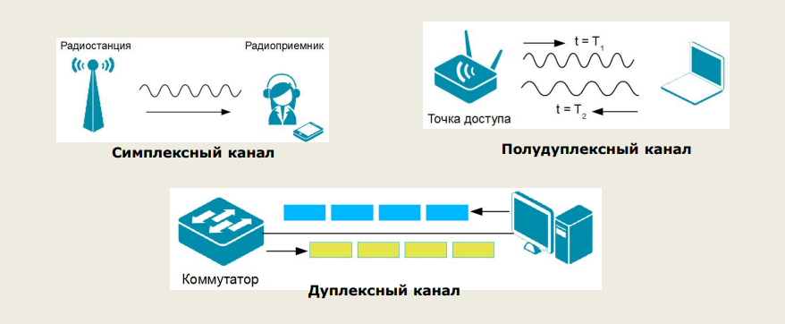

Компьютерные сети
=================

Вводная пара(12.01)
-------------------

Список лабораторных работ[^1]:

[^1]: Думаю понадобятся

- Построение локальной сети

- Изучение таблицы мушраизации

- Изучение диагностических утилит ip-сетей

- Моделирование работы сети в Net-simulator

- Преобразование IP-адресов. Расчет IP-адреса и маски подсети.

 

### Основные понятия

Сеть связи(в общем случае) - система коммуникаций для передачи информации на расстоянии.

Виды сетей:

- теле-радиовещательные сети

- сети телефонной и сотовой связи

- кабельного тв

- компьютерные(вычислительные)

 

Отдельный компьютер - *централизованнная* вычислительная система.

Компьютерная сеть - *распределённая* вычислительная система, т.е. компьютерные ресурсы и возможности распределены по
разным участниками для их совместного использования.

Компьютерная сеть включает:

- совокупность компьютерной техники и сетевых техники

- каналов связи

- ПО(управляет информационныс взаимодействием компьютеров в сети)

 

#### Зачем компьютеры объединяются в сеть?

Сеть позволяет пользователям разных компьютеров обмениваться информацией и получать доступ к удалённым ресурсам.

Назначение Комп. сети:

Компьютеры соединяются в сеть для обмена информацией и соместного использования компьютерных ресурсов в режиме
разделения времени.

Ресурсы доступные в сети называют разделяемыми ресурсами.

 

#### Совместное использование ресурсов

До появления сетей каждый пользователь должен был иметь свой принтер, плоттер и др.

Единственннный способ совместно использовать принтер - пересесть за ПК, подключённый к принтеру.

Теперь сети позволяют многим пользователям одновременно *владеть* данными и переферийными устройствами.[^2]

[^2]: Мне кажется и так довольно понятная информация.

 

#### Общение между пользователями.

Общение между пользователями сети может происходить посредством специальных сайтов(соц сети, блоги, фоурмы и т.д.),
электронные почты(email), чатов, видеоконференций, IP-телефонии.

 

#### Предоставление услуг пользователям

Сюда можно отнести покупку-продажу всевозможных товаров, электоронные платёдные системы, интернет-радио, телевидение,
реклама, онлайн-игры.

 

#### Продолжение основных понятий

Трафик - поток данных по каналу свзяи или через сетевое устройство, а также объем этого потока(в байтах).

 

Диаметр сети - расстояние между двумя наиболее удалёнными друг от друга станциями сети.

 

Адрес узла сети (сетевой адрес) - уникальный индефикатор узла сети, описывающий его местонахождение и позволяющий
пересылать информауию именно этому узлу.

 

Компьютеры объединённые в сеть, а также другие сетевые устройства, называются узлами сети.

 

Протокол - набор правил о передаче информации по сети. Т.е. каждая программа, претендующая на работу в сети должна
следовать правилам для приёма и передачи данных(иначе не будет обеспечена совместимость программ)

Оболочка для передачи информации.

 

Канал связи - система технических средств и среда распространения сигналов для прередачи данных от источника к
получателю.

 

Обмен информации производится по *каналам передачи информации.*

Каналы передачи информации могут использовать различные физ. принципы.

Общая схема передачи информации включает в себя отправителя информациии, канал передачи информации и получателя.

 

 

Отправитель информации \<-----\> Канал передачи информациии \<-----\> Получатель

 

Характеристика компьютерной сети:

- Производительность - описывается пропускной способностью, скоростью передачи данных и временем реакции

- Надёжность - описывается доступностьи и отказоустойчивости

- Доступность

- Отказоустойчевость

- Пропускная способность

- Скорость передачи данных

- Безопасность

    - Конфендациальность - это способность сети обеспечивать только тех пользователей

    - Целостность - способность сети обеспечивать сохранность ресурсов

 

### Классификация компьютерных сетей

1. По технологии передачи данных

    - Вещание(ТВ, радиовещание)

    - Точка к точке(Peer to Peer)

2. По способу комутации данных

    - Каналов

    - Пакетов

    - Сообщений

3. По ...

    - Прводные

    - Беспроодные

4. По скорости передачи данных

    - Низкоскоростные

    - Скоростные

    - Высокоскоростные

5. По терретариальной распространнённости:

    - Локальная сеть

    - Персональная сеть

    - Кампусная сеть

    - Корпоративная сеть

    - Региональная сеть

    - Глобальная сеть

6. По принципу организации иерархии компьютеров

    - одноранговая сеть

    - с выделенным сервером

Существуют различные способы организации совместной работы активного и пассивного сетевого оборудования, и поэтому, есть
множество способов классификации сетей.

### Топология сетей

Набор правил для физического соединения узлов сети и организации взаимодействия сетевых устройств называется сетевой
топологией

**Физическая топология** - это схема размещения физических компонентов сети

**Логическая топология** - это способ взаимодействия узлов при передачи данных

Топологии сетей можно разделить на две основные группы:

- полносвязные

- неполносвязные

Преимущества сотовых сетей:

- Высокая надёжность, обусловленная избыточностью физических связей

- простота диагностики

Неполносвязная топология

Шина - это линия связи, которую несколько устройств используют для обмена данными

Если один компьютер передаёт данные, то они доступны всем узлам, но получает их тот, чей адрес настроен как адрес
получателя.

Терминатор используется для поглащения блуждающих сигналов.

Если два узла начинают одновременно передачу данных, то начинает колизия(сигналы смешиваются).

Достинства:

- Низкая стоимость

- Простота расширения

Недостатки:

- Низкая производительность

- Низкая надёжность

- Сложность диагностики при разрыве и отказе разъёма

- Любой дефект кабеля или разъема приводит к неработоспособности всей сети

- Возможны коллизии

 

Топология Звезда

.....тут будет картинка

Достоинства:

- Высокая пропусканая способность

- Выход из строя узла влияет на работоспособность сети

- Легкость включения в сеть новых узлов

- Простой поиск не исправнастей

 

Таким образом данная топология является самой распространённой.

 

Топология кольцо

Каждое устройство подключается к сетевому кабельному кольцу, по которому передаются данные в одном направлении. Каждый
узел, сверяет общие данные, с адресом получателя.

Достоинства:

- Нет колизии

- Нет потери сигнала

- Высокая отказоустойчивость

Недостатки:

- Отказ одного узла может привести к неработоспособности всей сети

- Добавление/удаление узла вынуждает разрывать сеть

- Низкая производительность

- Обычно прокладывают два кольца, то это дорого

Таким образом кольцевую топологию целесообразно использовать для построения высокоскоростной сети, если наращивание сети
не планируется

#### Смешанная топология

Звезда-зведа(самая распрастранеённая)

Звезда-шина(тоже распрастранённая)

Выбор топологии сети

Факторы, которые необходимо учитывать:

1. Имеющуюся кабельную систему и оборудование

2. Местоположение компьютеров и оборудования

3. Размеры планируемой сети

4. Объём и тип информации для совместного использования

На практике, в основном древовидная структура из нескольких звёзд.

### Способы организации Локальной сети

Типв локальной сети:

- одноранговые

- с выделенным сервером - позволяет управлять доступом к информации других участников ЛС, большая надежности для
  хранения информации

Сетевая ОС поддерживает:

- сетевое оборудование

- сетевые протоколы

- доступ к удалённым ресурсам

Сервер - компьютер, предоставляющий свои ресурсы в общее использование.

Клиент - компьютер, пользующий услугами сервера.

 

Одноранговые сети

Все компьютеры равноправны, каждый может выступать как в роли клиента, так и роли сервера.

Разделяемые ресурсы:

**Установка прав доступа**

Плюсы:

- дешивизна

- простота настройки и обслуживания

- независимость компьютеров друг от друга

Минусы:

- Малое количество компьютеров

- Сложность управления и настройки прав доступа

- низкая защищённость данных

- резервное копироавание на каждом компьютере

Технология “клиент-сервер”

Клиент

- посылает запрос с заданием

- выводит на экран ответ полученный от сервера

Сервер

- принимает запросы от клиентов и ставит их в очередь

- выполняет задание

- посылает ответ с результатами

Достоинства:

- вся оброботка данных на сервере, PC могу быть маломощным

- дешевле модернизация

- меньше нагрузка на сеть

- защита на сервере

Недостатки:

- финансовые затраты

- сложная настройка сервера

Терминальный доступ - доступ к информационной системе(ИС), организованный так, что локальная машина-терминал не
выполняет вычислительные работы, а лишь осуществляется перенаправление ввода ввода информации на терминальный сервер и
отображает графическую информацию на монитор.

 

клиент: клавитура + монитор, нет винчестера  
сервер: время процессора, ОЗУ, диски, принтеры и т. п.

 

Плюсы:

- дешивизна клиентов

- проще администрирование

- выше безопасность

Минусы:

- при отказе сервера ничего не работает

- ошибки в настройках влияют на всех

 

**Задание**

Перечислить виды серверов и указать их назначения

 

Сетевые модели
--------------

### Необходимость стандартизации сетевого взаимодействия

- Для того чтобы передать данные, взаимодействующим компьютерам надо последовательно выполнить ряд процедур, называемых
  сетевыми протоколами.

- Чтобы протоколы работали надёжно и согласованно, каждая процедура в них строго регламентируется.

- Различия в протоколах делают коммуникации между разными компьютерами достаточно сложной задачей. Чтобы программы и
  оборудование разных производителей были совместимы и могли взаимодействовать друг с другом, протоколы должны
  соответствовать определённым промышленным стандартам.

- Для упрощения разработки протоколов были созданы модели

- Декомпозиция - разбиение задачи на модули

### Сетевые модели

Модель - это схема, определяющая общие концепции или представляющая руководящие принципы как легко воспринимаемое
описание

Сетевые модели описывают различные технологии и способы их взаимодействия друг с другом для осуществления передачи
данных по сети.

Наиболее распространение получила эталонная модель взаимодействия открытых систем(1984 год)

Под открытыми понимаются общедоступными спецификации соотвествующие стандарты и принятые в результате достижения
согласия всеми заинтересованными сторонами.

 

Эталонная модель взаимодействия открытых систем(OSI) - описывает способ передачи информации по сети от приложения на
другом компьютере

Модель OSI является концептуальной модель

 

Взаимодействие между уровнями

Обмен данными становится

Протокол - набор правил и соглашений, регламентирующий обмен информацией между уздами

Стек протоколов - совокупность протоколов

| Номер уровня | ПКА                   | ПКВ | Функции                                                                                                                                                                                               | Физ. уровень                                       |
|--------------|-----------------------|-----|-------------------------------------------------------------------------------------------------------------------------------------------------------------------------------------------------------|----------------------------------------------------|
| 7            | Уровень приложений    | 7   | Обеспечивает интерфейс взаимодействия программ, работающих на компьютерах в сети. С помощью этих программ пользователь получает доступ к сетевым услугам                                              | Представление сервисов для приложений              |
| 6            | Уровень представлений | 6   | Определяет форматы передаваемой информации. Задачи: перекодировка, сжатие и распаковка данных, их шифрование и дешифрование                                                                           | Общий формат представления данных и шифрование     |
| 5            | Сеансовый уровень     | 5   | Позволяет сетевым приложениям устанавливать, поддерживать и завершать соединение называемое сетевым сеансом. Обеспечивает синхронизацию. Отвечает за восстановление аварийно прерванных сеансов связи | Установление диалогов между приложениями           |
| 4            | Транспортный уровень  | 4   | Сегментирует и повторно собирает данные в один поток. Обеспечивает надежную доставку информацию между узлами сети.                                                                                    | Транспортировка данных по сети                     |
| 3            | Сетевой уровень       | 3   | Обеспечивает соединение и выбор маршрута между двумя узлами, которые могут находиться в сетях, расположенных в разных концах земного шара, обеспечивает единую систему адресации                      | Выбор наилучшего пути передачи пакетов и адресации |
| 2            | Канальный уровень     | 2   |                                                                                                                                                                                                       | Доступ к среде передачи                            |
| 1            | Физический уровень    | 1   |                                                                                                                                                                                                       |                                                    |

Типы серверов и их назначение:

- Сервер рабочей группы

  Это аппаратно-программный комплекс начального уровня преимущественно с одним процессором, который небольшие компании,
  организации, предприятия располагают прямо в своем офисе, так как нет возможности подыскать специальное место
- Сервер контроллер домена

  Машина нужна для централизованного управления сетевыми ресурсами и файлами организации, когда количество рабочего
  персонала перевалило за двадцатку. Параллельный функционал, как и у серверов печати.
- Прокси сервер

  Безопасная работа офисного персонала компании или организации в сети интернет обеспечена данным типом серверного
  устройства. Все или избранные компьютеры офиса имеют доступ к интернету. К шлюзу выдвигают особые требования высокой
  производительности и отказоустойчивости, если персонал работает во внешней сети для развития бизнеса компании. Работа
  специализированного ПО зачастую потребляет огромное количество системных ресурсов: полноценная работа антивирусов в
  реальном времени, анализ атак, учет трафика и т.п.
- Сервер электронной почты

  Машина работает с почтовыми приложениями, обрабатывает информацию. Обычно устанавливают серверы компании, у которых в
  штате числится около 40 сотрудников максимум. Обеспечивает централизованное управление перепиской внутри сети, внешней
  корреспонденцией. Узел отлично справляется и с такой функцией, как управление документооборотом. Настраивают фильтры,
  используют специальные программы, чтобы меньше получать нежелательной почты и исключить возможность потерять важные
  данные, избежать попадания конфиденциальной информации третьим лицам.
- Веб сервер

  ОЧЕНЬ КРАТКО: Для сайтов.
- Терминальный сервер

  Обеспечивает естественный доступ через интернет к рабочим ресурсам сотрудникам, которые работают из дома, во время
  путешествий и командировок. Серверы обеспечивают нормальное и качественное функционирование удаленных офисов.
- Сервер базы данных

  ОЧЕНЬ КРАТКО: Для БД.
- Файловый сервер

  Сервер для хранения каких-то данных
- Серверы приложений
- Брандмауэры, фаерволы

  Защитные системы, блокирующие отрицательное воздействие из интернета. Исходящие данные проходят без проблем. А
  обратная связь организована сложнее: полный анализ поступающего информационного потока. Сервер определяет опасные,
  вредоносные данные и извлекает их из общей информационной массы.
- Серверы DHCP

  В локальной сети IP-адрес компьютерным агрегатам назначают в ручном режиме, также реально сделать это и автоматически
  благодаря серверу DHCP.
- Серверы FTP

  FTP серверы разработаны и созданы для поддержки работы упрощенных компьютерных программ, позволяющих выполнить самые
  частые операции над файлами.
- Принт-серверы

  Устройства этого вида дают возможность всем компьютерам в ЛС печатать документацию на печатном оборудовании общего
  назначения, доступного всем.
- Домашний сервер

#### Инкапсуляция данных

- Каждый уровень эталонной модели зависит от услуг нижележащего уровня. Чтобы обеспечить эти услуги, нижележащий уровень
  при помощи процесса инкапсуляции помещает PDU(Protocol Data Unit), полученный от вышележащего уровня, в свое поле
  данных и добавляет служебную информацию, необходимую соотвествующему уровень для реализации своей функции.
- По мере перемещения данных вниз по уровням модели OSI, к ним будут прикрепляться дополнительные заголовки и трейлеры(
  конечные ограничители)
- Заголовки, увеличивают объем передаваемой информации, но обеспечивают...

Наибольший вклад OSI - это чёткое разделение трех концепций: служба, интерфейс, протокол.

IEEE (Institute of Electrical and Electronic Engineers) - Институт инженеров по электронике и радиотехнике, который
занимается стандартизацию сетей.

### Среда передачи данных

Среда передачи или физ. среда - материальная субстанция, через которую осуществляется распространение сигналов


Канал связи – совокупность одной или нескольких физических сред передачи и каналообразующего (сетевого) оборудования,
которые обеспечивают передачу данных между взаимодействующими системами в виде сигналов, соответствующих типу физической
среды.


- Каналы связи разделяют на:
    - физические (physical link);
    - логические (logical link);
- Физические каналы подразделяются на:
    - электрические (витая пара, коаксиальный кабель);
    - оптические (волоконно-оптический кабель);
    - беспроводные (радиоканалы, инфракрасные каналы и т.д).


Каналы (линии) связи можно классифицировать на основе следующих признаков:

- по типу физической среды;
- по типу представления передаваемой информации;
- по направлению передачи данных;
- по времени существования;
- по способу подключения;
- по ширине полосы пропускания.

В зависимости от направления передачи данных различают каналы:

- Симплексные – передача осуществляется только в одном направлении;
- полудуплексные – передача ведется поочередно в прямом и обратном направлении;
- Дуплексные – передача ведется одновременно в двух направлениях - прямом и обратном)



К основным характеристикам канала (линии) связи, существенно влияющим на качество передачи сигнала, можно отнести:
Полоса пропускания – диапазон частот, в пределах которого амплитудно-частотная характеристика линии связи достаточно
равномерна для того, чтобы обеспечить передачу сигнала без существенного искажения его формы. Измеряется полоса
пропускания в герцах (Гц). Ширина полосы пропускания:

- влияет на максимально возможную скорость передачи информации по каналу связи;
- зависит от типа среды передачи;
- зависит от наличия в каналах частотных фильтров.

Затухание — это величина, показывающая насколько уменьшается мощность сигнала на выходе канала связи по отношению к
мощности сигнала на входе. Затухание:

- характерно как для аналоговых, так и для цифровых сигналов;
- влияет на расстояние, которое сигнал может пройти между двумя точками без усиления или восстановления;
- увеличивается с ростом частоты сигнала.

Помехоустойчивость – способность канала противостоять воздействию помех. В зависимости от источника возникновения и от
характера их воздействия помехи делятся на:

- внутренние;
- внешние;
- взаимные.

Внутренние помехи возникают от источников, находящихся в данном канале связи и появляются сразу же после включения
оборудования связи.

Внешние помехи делятся на:

- промышленные (лампы дневного света, бытовые приборы, компьютеры, радиосистемы, линий электропередач и т.д);
- радиопомехи (излучения радиостанций различного назначения);
- атмосферные (магнитные бури, северное сияние, грозовые разряды);
- космические (излучение Солнца, видимых и невидимых звезд).

Взаимные (перекрестные) помехи или наводки возникают при передаче информации по смежным каналам – сигнал, переданный по
одному каналу связи, создает нежелательный эффект в другом.

Способы борьбы с помехами в электрических кабелях:

- экранирование используется для защиты от электромагнитных и радиопомех. Экран представляет собой металлическую оплетку
  или фольгу, которая окружает каждый провод или группу проводов в кабеле. Он действует как барьер для взаимодействующих
  сигналов.
- скручивание проводников используется для подавления перекрестных наводок на ближнем конце и перекрестных наводок на
  дальнем конце.

Наиболее защищенными от помех являются оптические каналы. Наименее защищенными от влияния помех являются беспроводные
каналы связи. Основные характеристики канала связи

Достоверность передачи данных характеризуется вероятностью ошибочного приема каждого передаваемого бита данных, т.е.
частотой появления ошибочных битов. Повысить достоверность передаваемых данных можно путем повышения помехоустойчивости
канала связи.

В компьютерных сетях применяются кабели, удовлетворяющие определенным стандартам, что позволяет строить кабельную
систему сети из кабелей и соединительных устройств разных производителей.

Кабели можно разделить на две группы:

- электрические:
    - витая пара;
    - коаксиальный кабель;
- волоконно-оптические:
    - одномодовый оптический кабель;
    - многомодовый оптический кабель.

Коаксиальный кабель – электрический кабель, состоящий из соосно-расположенных центрального проводника и экрана, и
служащий для передачи высокочастотных сигналов.

Витая пара – изолированные проводники, попарно скрученные между собой с необходимым числом раз на единицу длины и
заключенные в пластиковую оболочку.

Существуют два основных типа кабелей на основе витой пары:

- неэкранированная витая пара (UTP);
- экранированная витая пара (STP).

Разновидности кабелей на основе экранированной витой пары:

- экранированная витая пара (STP);
- защищенная витая пара (ScTP);
- защищенная экранированная витая пара (SSTP).

|     Категория               |     Полоса частот    |     Технологии                                                          |     Комментарии                                                                                                              |   |
|-----------------------------|----------------------|-------------------------------------------------------------------------|------------------------------------------------------------------------------------------------------------------------------|---|
|     -                       |     до 100 КГц       |     xDSL                                                                |     Телефонный кабель. Используется только для передачи голоса или данных при помощи аналогового или ADSL-модема.    |   |
|     -                       |     до 1 МГц         |     ISDN, 1BASE5                                                        |     Сейчас не используется                                                                                                   |   |
|     Category 3 (Cat. 3)     |     до 16 МГц        |     Token Ring     10BASE-T                                             |     2-х парный кабель UTP. Основное применение - передача голоса                                                       |   |
|     Category 4  (Cat. 4)    |     до 20 МГц        |     Token Ring     10BASE-T     100BASE-T                               |     4-х парный кабель UTP. В дальнейшем не рассматривается.                                                            |   |
|     Category 5  (Cat. 5)    |     до 100 МГц       |     10BASE-T     100BASE-TX     (2 пары)     1000BASE-T     (4 пары)    |     4-х парный кабель UTP. В дальнейшем не рассматривается                                                             |   |
|     Category 5e  (Cat. 5e)    |     до 125 МГц     |     10BASE-T, 100BASE-TX     (2 пары), 1000BASE-T     (4 пары)    |     4-х парный кабель UTP. Наиболее распространен в современных сетях.                        |   |
|     Category 6  (Cat. 6)      |     до 250 МГц     |     1000BASE-T     10GBASE-T                                              |     4-х парный кабель UTP. Ограничивает максимальное расстояние передачи для 10GBASE-T до 55 м.    |   |
|     Category 6a  (Cat. 6a)    |     до 500 МГц     |     1000BASE-T     10GBASE-T                                              |     4-х парный кабель U/FTP, F/UTP.                                                                    |   |
|     Category 7  (Cat. 7)      |     до 600 МГц     |     1000BASE-T     10GBASE-T                                              |     4-х парный кабель F/FTP, S/FTP.                                                                    |   |
|     Category 7  (Cat. 7a)     |     до 1000 МГц    |     1000BASE-T     10GBASE-T                                              |     4-х парный кабель F/FTP, S/FTP.                                                                    |   |
|                               |                    |                                                                           |                                                                                                        |   |

Волоконно-оптический кабель – это среда передачи, состоящая из оптических волокон, заключенных в защитную внешнюю
оболочку.

Многомодовые волокна изготавливают двух видов:

- со ступенчатым изменением показателя преломления;
- с плавным изменением показателя преломления.

### Сетевое оборудование

Сетевое оборудование - это оборудование, используемое для организации компьютерной сети, можно разделить на два вида:
пассивное и активное.


Структурированной кабельной системой (СКС) называется кабельная система здания или группы зданий, отвечающая требованиям
стандартов. СКС определяют международные, европейские и национальные стандарты.

Кабель – это конструкция из одного или нескольких изолированных друг от друга проводников, или оптических волокон,
заключённых в оболочку.

Патч-корд – это коммутационный кабель, соединяющий конечного пользователя с сетью, или использующийся для подключения
активного сетевого оборудования.

Розетка – это конечная точка, к которой подводится кабель-канал или скрытый за стеной кабель. Встраивается в стену и
надежно фиксирует подключаемые к ней кабели.

Коннекторы - это разъемы, находящиеся на концах патч-корда.

Коммутационная патч-панель объединяет все кабели, идущие от рабочих мест, которые затем подключаются к портам активного
сетевого оборудования.

Коммутация осуществляется патч-кордами. Монтируется в 19 -дюймовую стойку или на стену.

Для подключения компьютера к сети и взаимодействия с другими сетевыми устройствами используется сетевой адаптер. По
конструкторской реализации сетевые адаптеры делятся на:

- интегрированные в материнскую плату компьютера или ноутбука;
- внутренние, представляющие собой отдельную печатную плату, устанавливаемую в слот PCI, PCI Express, PCIe компьютера;
- внешние, подключающиеся к компьютеру или ноутбуку через интерфейс USB или CardBus (PCMCIA).

Для того чтобы узнать MAC-адрес сетевого адаптера компьютера в ОС Windows используется следующая команда:

```cmd
ipconfig /all
```

Медиаконвертер или преобразователь среды передачи — это устройство, преобразующее среду распространения сигнала из
одного типа в другой.

Повторитель (repeater) - устройство физического уровня модели OSI, используемое для соединения сегментов среды передачи
данных с целью увеличения общей длины сети (под сегментом понимается кабель). Повторитель принимает сигналы из одного
сегмента сети, усиливает их, восстанавливает синхронизацию и передает в другой.

Концентратор (хаб):

- работает на физическом уровне модели OSI;
- повторяет сигнал, поступивший с одного из своих портов на все остальные активные порты, предварительно восстанавливая
  его;
- не выполняет никакой фильтрации трафика и другой обработки данных.

Мост:

- работает на канальном уровне модели OSI;
- пересылает через себя кадры (блок данных канального уровня) только в том случае, если такая передача действительно
  необходима, то есть если физический адрес (МАС-адрес) узла назначения принадлежал другому сегменту сети или другой
  сети;
- изолирует трафик одного сегмента сети от трафика другого.


Коммутатор (switch) функционирует на канальном уровне модели OSI и служит для объединения сетевых устройств в пределах
одного или нескольких сегментов сети.

Микросегментация – разбиение коммутатором локальной сети одного домена на меньшие домены для каждого порта.

**Передача кадров через коммутатор**


Коммутатор передает кадры через все порты, если:

- в таблице коммутации отсутствует запись соответствия MAC-адреса устройства и порта коммутатора;
- МАС-адрес назначения является широковещательным (кадр предназначен всем узлам сети).

Точка доступа (Access Point) функционирует на канальном уровне модели OSI и представляет собой беспроводную станцию,
которая обеспечивает доступ ассоциированных с ней беспроводных клиентских устройств к проводной и/или беспроводной сети
через беспроводную среду передачи.

Маршрутизатор (router) – это устройство сетевого уровня модели OSI, основной задачей которого является анализ сетевых
адресов (IP-адресов) и определение наилучшего маршрута передачи пакета от источника к получателю.

Межсетевой экран (Брандмауэр Файрвол) - представляет собой программный или программно-аппаратный комплекс, который
проверяет данные, входящие через сеть, блокирует их или позволяет им пройти в компьютер;

- защищает компьютер от проникновения хакеров или вредоносных программ (например, от червей) по сети;
- также помогает предотвратить отправку вредоносных программ на другие компьютеры


### Сетевая технология Ethernet

Ethernet – это технология построения кабельных
локальных сетей. Стандарты Ethernet описывают
реализацию физического и канального уровней
модели OSI.

#### IEEE 802.3 определяет следующие параметры

- Сетевая топология – шина
- Сетевой кабель – коаксиальный кабель
- Скорость передачи – 10 МБит/с
- Максимальная длина сети – 2500 м
- Максимальное количество узлов – 1024
- Максимальная длина сегмента сети – 500 м
- Максимальное количество узлов в одном
сегменте – 100
- Метод доступа – CSMA/CD
- Метод кодирования – Манчестер-II

Физический уровень определяет электрические/оптические
спецификации, механические интерфейсы, кодирование и
синхронизацию битов и зависит от протокола подуровня МАС.

В спецификации IEEE 802 канальный уровень модели OSI
был разбит на два подуровня:
- управление логическим каналом (Logical Link Control, LLC);
- управление доступом к среде передачи (Media Access
Control, MAC).

Достоинства:
- Простая архитектура в технической реализации;
- Дешевое оборудование по сравнению с другими
архитектурами;
- Использование любой среды передачи данных;
- Высокая совместимость различных вариантов
Ethernet, что позволяет наращивать мощность
сети и расширять сеть

Недостатки:
- При увеличении количества узлов в сети растет
число коллизий, что снижает пропускную
способность сети и увеличивается время доставки
пакета.


### Методы доступа: [тут](https://drive.google.com/file/d/14FK0sV4jeskIkQv7SxhG7b7d656F0Q6-/view?usp=sharing)