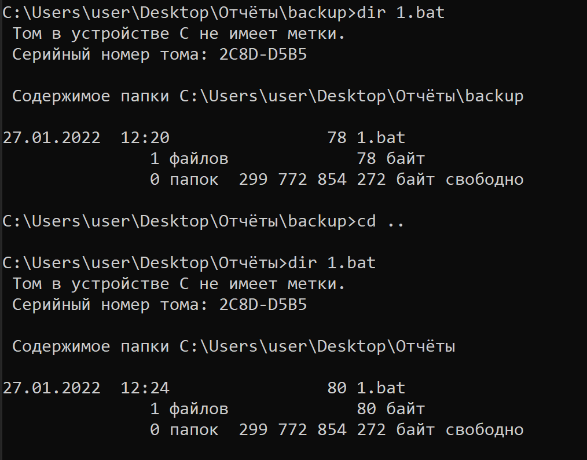
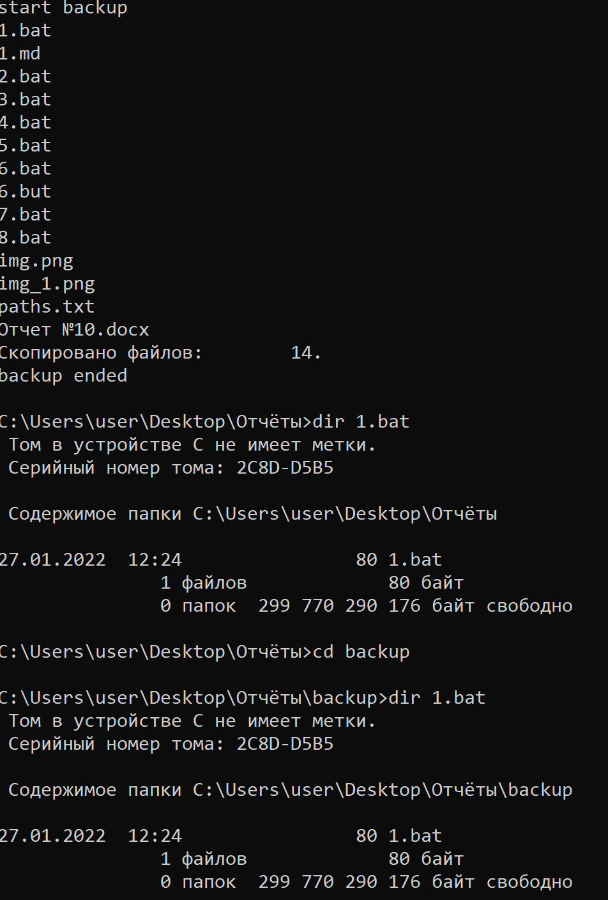
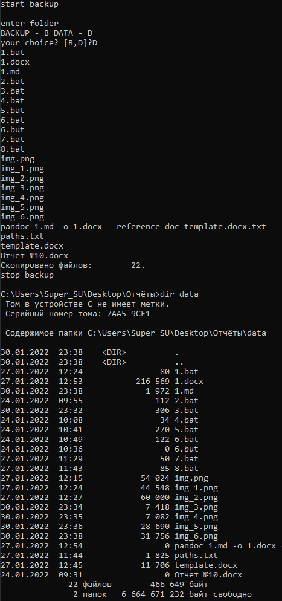
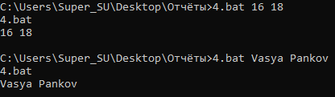
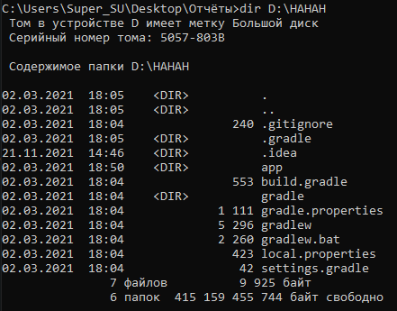
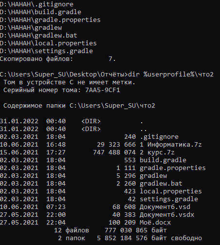
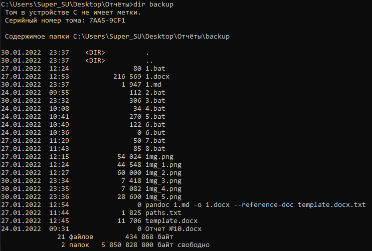
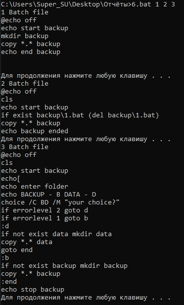
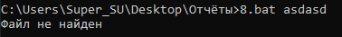

# ЛАБОРАТОРНАЯ РАБОТА №10,11. Пакетные файлы в операционных системах ms-dos b windows

**Цель работы:** - научится создавать пакетные файлы, получать в них прараметры и выполнять некоторые операции с файлами.

### Задание 1
Смысл этого файла будет в том, чтобы он создал новую папку BACKUP и скопировал туда содержимое текущей папки.
```bat
@echo off
echo start backup
mkdir backup
copy *.* backup
echo end backup
```
Тесты:


### Задание 2
Предварительная проверка файла наличия файла 1.bat в папке BACKUP и удаление его перед копированием новой версии файла 4.bat в эту папку
```bat
@echo off
cls 
echo start backup
if exist backup\1.bat (del backup\1.bat)
copy *.* backup
echo backup ended
```

Тесты:

Информация о том когда был изменён 1.bat в backup и вне backup:



Сам запуск 2.bat:



### Задание 3
Предоставим пользователю возможность выбрать папку, в которую будет производиться копирование всех файлов из текущей папки, из двух возможных вариантов: BACKUP или DATA.
```bat
@echo off
cls
echo start backup
echo enter folder
echo BACKUP - B DATA - D 
choice /C BD /M "your choice?"
if errorlevel 2 goto d
if errorlevel 1 goto b
:d
if not exist data mkdir data 
copy *.* data
goto end
:b 
if not exist backup mkdir backup
copy *.* backup
:end
echo stop backup
```
Содержимое папки backup:


Содержимое папки data:


Содержимое корневой папки:


Выбор папки backup:


Выбор папки data:



### Задание 4
Показать работу комментариев

```bat
rem Комментарий
:: Комментарий

goto start
--------------------------------------
Этот пакетный файл предназначен
для автоматизации рутинных операций, выполняемых ночью для синхронизации содержимого корпоративного ftp-сервера с ftp-серверами филиалов
--------------------------------------
Пакетный файл написан 01/01/2007 Последнее исправление внесено 10/02/2008
--------------------------------------
И т.д.
:start
```

Тест:


### Задание 5
Вывести название файла и первые два параметра.
```bat
@echo off

@echo %0
@echo %1 %2
```

Тесты:



### Задание 6

Пакетный файл которые в качестве параметра имеет название папки в которую будут скопированы файлы из диска D(если он существует).

Так как у меня есть диск D и он сильно заполнен то будет копироваться из папки Что, которая тоже лежит на диске D:

```bat
@echo off

cls
rem if _%1 == _ goto noparam, тоже будет работать
if "%~1" == "" goto noparam
if not exist %userprofile%\%1 mkdir %userprofile%\%1
if exist D:\ copy D:\Что\* %userprofile%\%1 
goto end
:noparam
echo Batch file needed argument
:end

```

Содержимое папки D:\HAHAH:



Выполнение без параметров:


Выполнение с параметром "что2":



### Задание 7

Рассмотрим пример использования команды shift для вывода на экран содержимого трех пакетных файлов, расположенных в каталоге backup, при использовании одного параметра:

```bat
@echo off

:start
if _%1 == _ goto end
echo %1 Batch file
type backup\%1.bat
echo:
pause
shift
goto start
:end
```

Содержимое папки backup:



Файл 1.bat 2.bat и 3.bat это Пакетные файлы для задания 1, 2, 3:



### Задание 8

Программа, которая выводит все .bat файлы в каталоге.

```bat
@echo off
cls
for %%f in (*.bat) do type %%f
```

### Индивидуальное задание 11 вариант

Написать командный файл создающий текстовый файл со списком всех файлов в указанной директории и во всех вложенных директориях. Путь к директории передать в качестве аргумента.

```bat
@echo off
if 
dir %1 /A:-d /S /B > paths.txt

echo All file paths are in paths.txt
```

При пустом параметре:


При неверном пути:



Обычное использование:


**Итог работы**: Я научился писать Batch файлы, обрабатывать в них параметры и делать свою логику.