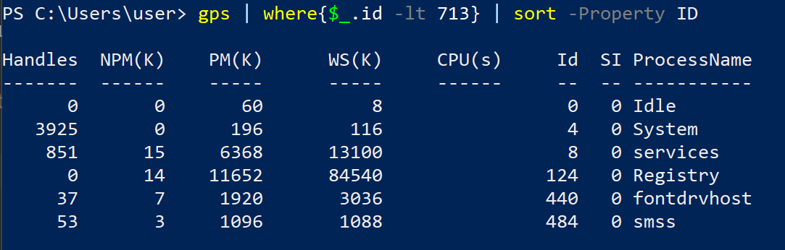
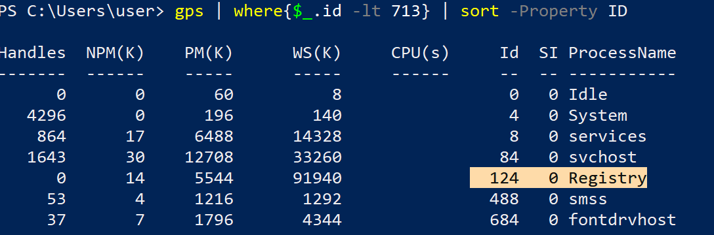

# ЛАБОРАТОРНАЯ РАБОТА №14. Работа со встроенной утилитой ОС WINDOWS «Диспетчер задач».

Цель работы: получить практические навыки работы с диспетчером задач, изучить его функции и возможности.

1. Проверьте все способы запуска Диспетчера задач, занесите в отчёт, запомните для себя самый подходящий способ.
   
   
   
    - Нажатие Ctrl+Shift+Escape
2. Посмотрите с помощью Диспетчера задач (вкладка «Приложения»), какие за-дачи у пользователя работают в данный момент.
   
3. Как в новой версии запустить новую задачу?
   
4. Введите команду Tasklist /SVC и нажмите клавишу ENTER. Перечислите процессы, обеспечивающие работу более, чем одной
   службы.
   
   Процессы с несколькими службами:
    - svchost.exe 944 BrokerInfrastructure, DcomLaunch, PlugPlay, Power, SystemEventsBroker
    - svchost.exe 1084 RpcEptMapper, RpcSs
    - svchost.exe 12104 OneSyncSvc_178bf0, PimIndexMaintenanceSvc_178bf0, UnistoreSvc_178bf0, UserDataSvc_178bf0
    - lsass.exe 780 EFS, KeyIso, SamSs, VaultSvc
5. Получите дополнительные сведения о процессе, ассоциированном с Диспетчером задач.
   
6. Пользуясь командой WHERE и шаблоном поиска найдите все DLL-файлы в папке c:\windows (поиск должен быть рекурсивным,
   т.е. по всем вложенным папкам). Сделайте скриншот фрагмента по-иска, назовите общее число таких файлов.

```cmd
WHERE /R c:\windows *.dll | find /v "" /c
WHERE /R c:\windows *.dll
```


7. С помощью команды ECHO и параметра %SystemRoot% выведите путь до системной папки. Приведите примеры нескольких
   переменных среды Windows 10, исследовав этот вопрос самостоятельно.
   
8. Выведите список процессов с PID в диапазоне от 0 до 700+№ студента по списку*10. Какие из перечисленных в
   теоретической части процессов попадают в этот список? Выполните перезагрузку системы, затем повторите указанный
   действия, сравните результат с предыдущим, сделайте вывод.

```powershell 
gps | where{$_.id -lt 713} | sort -Property ID
```



После перезапуска:

Вывод: есть предположения, что id до 127 не назначаются рандомно.

9. За что отвечает вкладка «Приложения»? Отображает запущенные на данный момент приложения.
10. Существуют ли приложения, которые не следует завершать? Нет, в основном тебе Windows не даст завершить важные **
    приложения**.
11. Какая информация содержится во вкладке «Процессы»? Информация о процессах, которые запущены в данный момент.
12. Выпишите названия служб: криптографии, маршрутизации и удалённого доступа, диспетчера печати. Есть ли в списке
    службы с одинаковыми ИД процесса? Если да, то приведите пример и объясните по-чему?
    <br>Служба криптографии:  <br> Службы маршрутизации: 